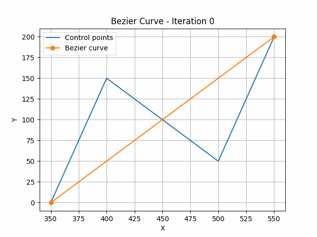

# Program Description




This is a program that simulates the generation of Bezier curves using divide and conquer/bruteforce algorithms. The program accepts a list of control points as well as an iteration number, and will generate the corresponding Bezier Curve and visualize the result in Matplotlib and Manim.

# Dependencies and Requirements
The main dependencies of this program include:
- Matplotlib
- Manim
- FFmpeg

To install manim, please follow the guide at: https://docs.manim.community/en/stable/installation.html

To install FFmpeg, please follow the guide at: https://www.wikihow.com/Install-FFmpeg-on-Windows

Additionally, running the program requires the following Python libraries installed:
- typing
- termcolor
- PIL
- datetime
- numpy
- shutil
- subprocess
If you encounter errors relating to these libraries when running, please ensure you have these extensions installed.

# How to Run

To run the program:
1. run `cd src` to move to the source folder
2. Simply run `python dnc.py` to run the main program


Example usage:
```bash
cd src
python dnc.py
```

# Author Description
The author is a student at the Informatics Department of Bandung Institute of Technology. This project is created as a task for IF2211 Algorithm Strategies course.
